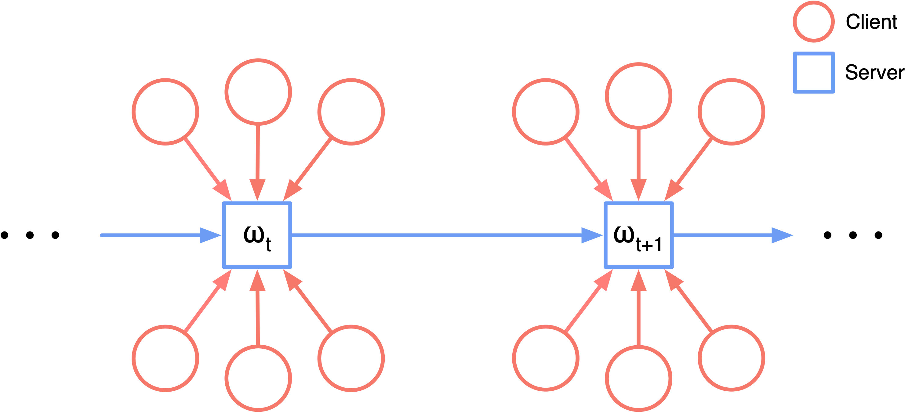

# Continual Local Training for Better Initialization of Federated Models

The implementation of "Continual Local Training for Better Initialization of Federated Models" (ICIP 2020).  
[[Conference Version]](#)[[arXiv Version]](https://arxiv.org/abs/2005.12657)

## Introduction

Federated learning (FL) refers to the learning paradigm that trains machine learning models directly in the decentralized systems consisting of smart edge devices without transmitting the raw data, which avoids the heavy communication costs and privacy concerns.
Given the typical heterogeneous data distributions in such situations, the popular FL algorithm *Federated Averaging* (FedAvg) suffers from weight divergence and thus cannot achieve a competitive performance for the global model (denoted as the *initial performance* in FL) compared to centralized methods.

In this paper, we propose the local continual training strategy to address this problem.
Importance weights are evaluated on a small proxy dataset on the central server and then used to constrain the local training.
With this additional term, we alleviate the weight divergence and continually integrate the knowledge on different local clients into the global model, which ensures a better generalization ability.
Experiments on various FL settings demonstrate that our method significantly improves the initial performance of federated models with few extra communication costs.

<div align="center"> 

</div>

## Dependency

```
python==3.7
pytorch==1.4
prefetch_generator
tensorboardx
```

## How To Run

1. Download the `dataset.tar.gz` in the [release page](https://github.com/thu-media/FedCL/releases/tag/v1.0), and unzip it to the root of the repository.

2. Then you can start with
   ```shell
   python cifar_main.py
   ```
   or
   ```shell
   python mnist_main.py
   ```
   The hyperparameters are defined in standalone file `config.py`.

## Code Structure

```
-- mnist_main.py     # the main train file for experiments on split MNIST
-- cifar_main.py     # the main train file for experiments on split CIFAR10
-- config.py         # the global config file
-- model/
  |_ cifar_model.py  # the model file for CIFAR10
  |_ mnist_model.py  # the model file for MNIST
-- data/
  |_ cifar_data.py   # define data loader and allocator for CIFAR10
  |_ mnist_data.py   # define data loader and allocator for MNIST
-- core/
  |_ agent.py        # core functions for FL clients, e.g., train/test/estimate importance weights
  |_ trainer.py      # core functions for FL server, e.g., model aggregation/initialize clients
  |_ utils.py        # define some utils
```

## Cite

If you find this work useful to you, please cite [the conference version](#):

```
To be published
```
or [the arXiv version](https://arxiv.org/abs/2005.12657):
```
@article{yao2020continual,
  title={Continual Local Training for Better Initialization of Federated Models},
  author={Yao, Xin and Sun, Lifeng},
  journal={arXiv preprint arXiv:2005.12657},
  year={2020}
}
```
